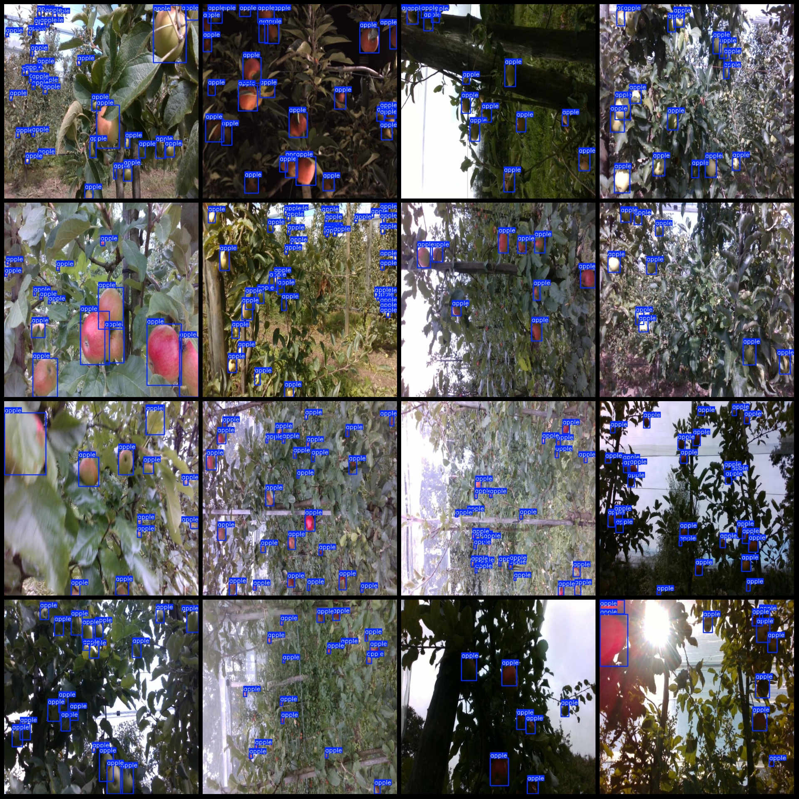

# Intelligent Orchard Apple Detection Dataset VOC+YOLO Format with 4459 Categories

Dataset Format: Pascal VOC format + YOLO format (without the segmentation path in the txt file, only containing jpg images and corresponding VOC format xml files and yolo format txt files)
Number of Images (jpg file count): 4459
Number of Annotations (xml file count): 4459
Number of Annotations (txt file count): 4459
Number of Annotation Categories: 1
Repository: firc-dataset
Annotation Category Name: ["apple"]
Number of Boxes per Category: 
apple boxes = 66321
Total Boxes: 66321
Image Resolution: 640x640
Annotation Tool Used: labelImg
Annotation Rules: Draw rectangles around categories
Important Notes: None
Special Disclaimer: This dataset does not guarantee the accuracy of the trained models or weight files.
Image Preview:

## Images

Here is a pay link on Stripe ( https://buy.stripe.com/3cs8yP7sY87d0vu9AB ). Please contact me lonlonago@foxmail.com after funding $89, and I will send you a complete data files , thank you!

